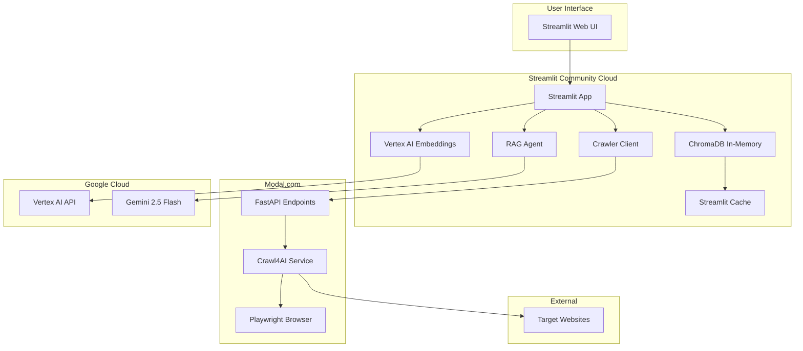
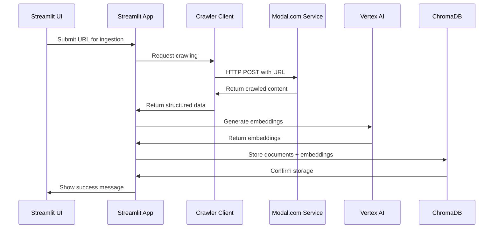

# Design Document

## Overview

Das Design migriert das bestehende monolithische RAG-System zu einer verteilten Cloud-Architektur. Das System wird in zwei Hauptkomponenten aufgeteilt:

1. **Modal.com Crawling Service**: Serverless Microservice für Playwright-basiertes Web-Crawling
2. **Streamlit Community Cloud App**: Hauptanwendung mit UI, Embeddings, Vektordatenbank und RAG-Agent

Diese Architektur löst die Inkompatibilität von Playwright mit Streamlit Community Cloud und nutzt die Stärken beider Plattformen optimal aus.

## Architecture



## Components and Interfaces

### 1. Modal.com Crawling Service

#### 1.1 Service Architecture
- **Platform**: Modal.com Serverless Functions
- **Runtime**: Python 3.11 mit Debian Slim Base Image
- **Dependencies**: Crawl4AI, Playwright, FastAPI, Pydantic
- **Browser**: Chromium (headless)

#### 1.2 API Design Considerations

**Current Approach**: Separate endpoints for different crawling modes
- **Pros**: Explicit, type-safe, clear separation of concerns
- **Cons**: More endpoints to maintain

**Alternative Unified Approach** (optional future enhancement):
```python
# Single endpoint with mode parameter
POST /crawl
{
    "mode": "single|batch|recursive|sitemap",
    "config": {
        "url": "...",           # for single
        "urls": [...],          # for batch
        "start_url": "...",     # for recursive
        "sitemap_url": "...",   # for sitemap
        "max_depth": 3,         # for recursive
        "max_concurrent": 10,   # for batch/recursive/sitemap
        "limit": 100            # for recursive
    }
}
```

**Recommendation**: Start with separate endpoints for clarity, consider unification later if needed.

#### 1.3 API Endpoints

**Base URL**: `https://{app-name}.modal.run`

##### POST /crawl_single
```python
# Request
{
    "url": "https://example.com",
    "cache_mode": "BYPASS"  # optional
}

# Response
{
    "success": true,
    "url": "https://example.com",
    "markdown": "# Page Content...",
    "links": {"internal": [...], "external": [...]}
}
```

##### POST /crawl_batch
```python
# Request
{
    "urls": ["https://example1.com", "https://example2.com"],
    "max_concurrent": 10  # optional
}

# Response
{
    "results": [
        {"success": true, "url": "...", "markdown": "...", "links": {...}},
        {"success": false, "url": "...", "error": "..."}
    ]
}
```

##### POST /crawl_recursive
```python
# Request
{
    "start_url": "https://example.com",
    "max_depth": 3,
    "max_concurrent": 5,
    "limit": 100  # optional
}

# Response
{
    "results": [
        {"success": true, "url": "...", "markdown": "...", "links": {...}},
        ...
    ]
}
```

##### POST /crawl_sitemap
```python
# Request
{
    "sitemap_url": "https://example.com/sitemap.xml",
    "max_concurrent": 10
}

# Response
{
    "results": [
        {"success": true, "url": "...", "markdown": "...", "links": {...}},
        ...
    ]
}
```

#### 1.3 Authentication
- **Method**: Bearer Token in Authorization Header
- **Storage**: Modal Secrets System
- **Format**: `Authorization: Bearer {api_key}`

#### 1.4 Error Handling
- **HTTP 401**: Invalid or missing API key
- **HTTP 500**: Crawling errors with detailed error messages
- **Retry Logic**: Exponential backoff for network errors
- **Timeout**: 30 seconds per request

### 2. Crawler Client (Streamlit Side)

#### 2.1 Client Architecture
```python
class CrawlerClient:
    def __init__(self, base_url: str, api_key: str)
    async def crawl_single(url: str) -> Dict
    async def crawl_batch(urls: List[str]) -> Dict
    async def crawl_recursive(start_url: str, **kwargs) -> Dict
    async def crawl_sitemap(sitemap_url: str) -> Dict
    
    # Synchronous wrappers for Streamlit
    def crawl_single_sync(self, url: str) -> Dict:
        return asyncio.run(self.crawl_single(url))
    
    def crawl_batch_sync(self, urls: List[str]) -> Dict:
        return asyncio.run(self.crawl_batch(urls))
    
    def crawl_recursive_sync(self, start_url: str, **kwargs) -> Dict:
        return asyncio.run(self.crawl_recursive(start_url, **kwargs))
    
    def crawl_sitemap_sync(self, sitemap_url: str) -> Dict:
        return asyncio.run(self.crawl_sitemap(sitemap_url))
```

#### 2.2 Configuration
- **Base URL**: From Streamlit Secrets (`MODAL_API_URL`)
- **API Key**: From Streamlit Secrets (`MODAL_API_KEY`)
- **Timeout**: 60 seconds for API requests
- **Retry**: 3 attempts with exponential backoff

#### 2.3 Error Handling
- **Connection Errors**: Retry with backoff
- **API Errors**: Parse and forward error messages
- **Timeout Errors**: Clear user feedback
- **Rate Limiting**: Respect API limits

### 3. ChromaDB Cloud Adaptation

#### 3.1 SQLite Compatibility Fix
```python
# At the very beginning of streamlit_app.py
__import__('pysqlite3')
import sys
sys.modules['sqlite3'] = sys.modules.pop('pysqlite3')
```

#### 3.2 In-Memory Database
```python
@st.cache_resource
def get_chroma_client():
    # Use in-memory client instead of persistent
    client = chromadb.Client()
    return client
```

#### 3.3 Collection Management
```python
@st.cache_resource
def get_or_create_collection(collection_name: str):
    client = get_chroma_client()
    try:
        collection = client.get_collection(name=collection_name)
    except:
        collection = client.create_collection(name=collection_name)
    return collection
```

#### 3.4 Memory Management
```python
@st.cache_resource
def get_collection_with_monitoring(collection_name: str):
    collection = get_or_create_collection(collection_name)
    
    # Monitor collection size
    doc_count = collection.count()
    if doc_count > 800:  # Warning threshold
        st.warning(f"Collection '{collection_name}' has {doc_count} documents. "
                  f"Performance may degrade above 1000 documents.")
    elif doc_count >= 1000:  # Hard limit
        st.error(f"Collection '{collection_name}' is at capacity ({doc_count} documents). "
                f"Please create a new collection or delete old documents.")
        st.stop()
    
    return collection
```

- **Collection Size Limit**: Max 1000 documents per collection
- **Batch Processing**: Process embeddings in batches of 100
- **Memory Monitoring**: Track collection size and warn users
- **Graceful Degradation**: Stop ingestion at hard limits
- **User Feedback**: Clear warnings and error messages

### 4. Modified Ingestion Pipeline

#### 4.1 Pipeline Flow


#### 4.2 URL Type Detection
```python
def detect_url_type(url: str) -> str:
    if url.endswith('.txt') or url.endswith('.md'):
        return 'text_file'
    elif 'sitemap' in url or url.endswith('.xml'):
        return 'sitemap'
    else:
        return 'website'
```

#### 4.3 Crawling Strategy Selection
- **Single Text File**: Use `/crawl_single` endpoint
- **Sitemap**: Use `/crawl_sitemap` endpoint  
- **Website**: Use `/crawl_recursive` endpoint
- **Multiple URLs**: Use `/crawl_batch` endpoint

### 5. Authentication and Security

#### 5.1 Modal.com Security
```python
# Modal service authentication
@app.function(secrets=[modal.Secret.from_name("crawl4ai-api-key")])
@modal.web_endpoint(method="POST")
async def crawl_endpoint(request: Request, authorization: str = Header(None)):
    if not authorization or authorization != f"Bearer {os.environ['API_KEY']}":
        raise HTTPException(status_code=401, detail="Unauthorized")
```

#### 5.2 Streamlit Secrets Management
```toml
# .streamlit/secrets.toml
MODAL_API_URL = "https://your-app.modal.run"
MODAL_API_KEY = "your-secure-api-key"
GOOGLE_CLOUD_PROJECT = "your-gcp-project"
GOOGLE_APPLICATION_CREDENTIALS_JSON = "base64-encoded-service-account-key"
```

#### 5.3 Google Cloud Authentication
```python
def setup_gcp_credentials():
    creds_json_b64 = st.secrets.get("GOOGLE_APPLICATION_CREDENTIALS_JSON")
    if creds_json_b64:
        creds_json = base64.b64decode(creds_json_b64).decode('utf-8')
        with tempfile.NamedTemporaryFile(delete=False, suffix='.json') as temp:
            temp.write(creds_json.encode('utf-8'))
            os.environ["GOOGLE_APPLICATION_CREDENTIALS"] = temp.name
```

## Data Models

### 1. Crawling Request Models
```python
class CrawlSingleRequest(BaseModel):
    url: str
    cache_mode: Optional[str] = "BYPASS"

class CrawlBatchRequest(BaseModel):
    urls: List[str]
    max_concurrent: Optional[int] = 10

class CrawlRecursiveRequest(BaseModel):
    start_url: str
    max_depth: Optional[int] = 3
    max_concurrent: Optional[int] = 5
    limit: Optional[int] = 100

class CrawlSitemapRequest(BaseModel):
    sitemap_url: str
    max_concurrent: Optional[int] = 10
```

### 2. Crawling Response Models
```python
class CrawlResult(BaseModel):
    success: bool
    url: str
    markdown: Optional[str] = None
    links: Optional[Dict] = None
    error: Optional[str] = None

class CrawlBatchResponse(BaseModel):
    results: List[CrawlResult]
```

### 3. ChromaDB Document Model
```python
class ChromaDocument:
    id: str  # Format: "doc_{url_hash}_{chunk_index}"
    document: str  # Chunk text
    metadata: Dict[str, Any]  # URL, headers, stats
    embedding: List[float]  # Vertex AI embedding
```

## Error Handling

### 1. Modal.com Service Errors
```python
class CrawlingError(Exception):
    def __init__(self, url: str, error: str):
        self.url = url
        self.error = error
        super().__init__(f"Failed to crawl {url}: {error}")

class AuthenticationError(Exception):
    pass

class RateLimitError(Exception):
    pass
```

### 2. Streamlit App Error Handling
```python
# Streamlit-compatible synchronous error handling
if st.button("Start Crawling"):
    with st.spinner("Crawling in progress..."):
        try:
            # Use synchronous wrapper for Streamlit compatibility
            result = crawler_client.crawl_single_sync(url)
            st.success("Crawling completed successfully!")
            st.json(result)
        except aiohttp.ClientError as e:
            st.error(f"Network error: {e}")
        except ValueError as e:
            st.error(f"API error: {e}")
        except Exception as e:
            st.error(f"Unexpected error: {e}")

# For long-running operations with progress tracking
def crawl_with_progress(urls: List[str]):
    progress_bar = st.progress(0)
    status_text = st.empty()
    
    try:
        result = crawler_client.crawl_batch_sync(urls)
        progress_bar.progress(100)
        status_text.text("Crawling completed!")
        return result
    except Exception as e:
        st.error(f"Crawling failed: {e}")
        return None
```

### 3. ChromaDB Error Handling
```python
try:
    collection = get_or_create_collection(name)
except Exception as e:
    st.error("ChromaDB initialization failed. Please refresh the page.")
    st.stop()
```

## Testing Strategy

### 1. Modal.com Service Testing
- **Unit Tests**: Test individual crawling functions
- **Integration Tests**: Test API endpoints with real URLs
- **Load Tests**: Test concurrent crawling limits
- **Error Tests**: Test error handling and timeouts

### 2. Crawler Client Testing
- **Mock Tests**: Test client with mocked Modal.com responses
- **Integration Tests**: Test client against live Modal.com service
- **Error Tests**: Test retry logic and error handling
- **Timeout Tests**: Test timeout handling

### 3. Streamlit App Testing
- **UI Tests**: Test user interactions and workflows
- **Integration Tests**: Test full ingestion pipeline
- **Memory Tests**: Test ChromaDB memory usage
- **Error Tests**: Test error display and recovery

### 4. End-to-End Testing
- **Workflow Tests**: Test complete user journeys
- **Performance Tests**: Test response times and throughput
- **Reliability Tests**: Test system stability over time
- **Security Tests**: Test authentication and authorization

## Performance Considerations

### 1. Modal.com Optimization
- **Cold Start**: ~2-3 seconds for first request
- **Warm Instances**: <500ms for subsequent requests
- **Concurrency**: Up to 10 parallel crawling tasks
- **Timeout**: 30 seconds per crawling request

### 2. Streamlit Optimization
- **Caching**: Use `@st.cache_resource` for expensive operations
- **Memory**: Monitor and limit ChromaDB collection sizes
- **API Calls**: Batch API requests where possible
- **UI**: Use `st.spinner()` for short operations, `st.progress()` for long ones
- **Async Handling**: Use `asyncio.run()` for async operations in Streamlit

### 3. User Experience Enhancements

#### 3.1 State Management for Long-Running Operations
```python
# Initialize session state for crawling operations
def init_crawling_state():
    if 'crawling_in_progress' not in st.session_state:
        st.session_state.crawling_in_progress = False
    if 'crawl_result' not in st.session_state:
        st.session_state.crawl_result = None
    if 'crawl_error' not in st.session_state:
        st.session_state.crawl_error = None
    if 'crawl_type' not in st.session_state:
        st.session_state.crawl_type = None

# Enhanced crawling UI with state management
def enhanced_crawling_ui():
    init_crawling_state()
    
    url_to_crawl = st.text_input("URL to crawl")
    crawl_type = st.selectbox("Crawling Type", 
                             ["Single Page", "Recursive", "Sitemap", "Batch"])
    
    # Disable button during crawling
    if st.button("Start Crawling", 
                disabled=st.session_state.crawling_in_progress or not url_to_crawl):
        # Set crawling state
        st.session_state.crawling_in_progress = True
        st.session_state.crawl_result = None
        st.session_state.crawl_error = None
        st.session_state.crawl_type = crawl_type
        st.rerun()  # Trigger rerun to show spinner immediately
    
    # Show crawling progress
    if st.session_state.crawling_in_progress:
        progress_container = st.container()
        
        with progress_container:
            st.info(f"🔄 {st.session_state.crawl_type} crawling in progress...")
            progress_bar = st.progress(0)
            status_text = st.empty()
            
            try:
                status_text.text("Initializing crawling...")
                progress_bar.progress(10)
                
                # Execute crawling based on type
                if st.session_state.crawl_type == "Single Page":
                    result = crawler_client.crawl_single_sync(url_to_crawl)
                elif st.session_state.crawl_type == "Recursive":
                    result = crawler_client.crawl_recursive_sync(
                        start_url=url_to_crawl,
                        max_depth=3,
                        limit=100
                    )
                elif st.session_state.crawl_type == "Sitemap":
                    result = crawler_client.crawl_sitemap_sync(url_to_crawl)
                
                progress_bar.progress(100)
                status_text.text("Crawling completed!")
                
                # Store result
                st.session_state.crawl_result = result
                
            except Exception as e:
                st.session_state.crawl_error = str(e)
                progress_bar.progress(0)
                status_text.text("Crawling failed!")
                
            finally:
                # Reset crawling state and trigger rerun to show results
                st.session_state.crawling_in_progress = False
                st.rerun()
    
    # Display results after crawling is complete
    if st.session_state.crawl_result:
        st.success("✅ Crawling completed successfully!")
        
        # Show summary
        results = st.session_state.crawl_result.get('results', [])
        if isinstance(results, list):
            successful = len([r for r in results if r.get('success', False)])
            total = len(results)
            st.metric("Pages Crawled", f"{successful}/{total}")
        
        # Show detailed results in expander
        with st.expander("View Crawling Results"):
            st.json(st.session_state.crawl_result)
        
        # Clear results button
        if st.button("Clear Results"):
            st.session_state.crawl_result = None
            st.session_state.crawl_error = None
            st.rerun()
    
    # Display errors
    if st.session_state.crawl_error:
        st.error(f"❌ Crawling failed: {st.session_state.crawl_error}")
        
        if st.button("Clear Error"):
            st.session_state.crawl_error = None
            st.rerun()
```

#### 3.2 Ingestion State Management
```python
# State management for the ingestion process
def init_ingestion_state():
    if 'ingestion_in_progress' not in st.session_state:
        st.session_state.ingestion_in_progress = False
    if 'ingestion_result' not in st.session_state:
        st.session_state.ingestion_result = None
    if 'ingestion_error' not in st.session_state:
        st.session_state.ingestion_error = None

def enhanced_ingestion_ui():
    init_ingestion_state()
    
    # Ingestion form
    with st.form("ingestion_form"):
        url = st.text_input("URL or File Path")
        collection_name = st.text_input("Collection Name (optional)")
        source_type = st.selectbox("Source Type", 
                                  ["Website", "Sitemap", "Text File"])
        
        if source_type == "Website":
            max_depth = st.slider("Max Depth", 1, 10, 3)
            limit = st.number_input("Page Limit", 0, 1000, 100)
        
        submitted = st.form_submit_button(
            "Start Ingestion",
            disabled=st.session_state.ingestion_in_progress or not url
        )
    
    if submitted:
        st.session_state.ingestion_in_progress = True
        st.session_state.ingestion_result = None
        st.session_state.ingestion_error = None
        st.rerun()
    
    # Show ingestion progress
    if st.session_state.ingestion_in_progress:
        st.info("🔄 Ingestion in progress... This may take several minutes.")
        
        progress_container = st.container()
        with progress_container:
            progress_bar = st.progress(0)
            status_text = st.empty()
            
            try:
                # Step 1: Crawling
                status_text.text("Step 1/3: Crawling content...")
                progress_bar.progress(10)
                
                # Step 2: Generating embeddings
                status_text.text("Step 2/3: Generating embeddings...")
                progress_bar.progress(50)
                
                # Step 3: Storing in database
                status_text.text("Step 3/3: Storing in database...")
                progress_bar.progress(90)
                
                # Execute ingestion (this would call your ingestion function)
                # result = run_ingestion_with_modal(...)
                
                progress_bar.progress(100)
                status_text.text("Ingestion completed!")
                
                st.session_state.ingestion_result = {
                    "success": True,
                    "collection": collection_name or "auto-generated",
                    "documents_added": 42  # placeholder
                }
                
            except Exception as e:
                st.session_state.ingestion_error = str(e)
                progress_bar.progress(0)
                status_text.text("Ingestion failed!")
                
            finally:
                st.session_state.ingestion_in_progress = False
                st.rerun()
    
    # Display ingestion results
    if st.session_state.ingestion_result:
        if st.session_state.ingestion_result.get("success"):
            st.success("✅ Ingestion completed successfully!")
            st.metric("Documents Added", 
                     st.session_state.ingestion_result.get("documents_added", 0))
        
        if st.button("Clear Ingestion Results"):
            st.session_state.ingestion_result = None
            st.rerun()
    
    if st.session_state.ingestion_error:
        st.error(f"❌ Ingestion failed: {st.session_state.ingestion_error}")
        
        if st.button("Clear Ingestion Error"):
            st.session_state.ingestion_error = None
            st.rerun()
```

### 3. ChromaDB Optimization
- **In-Memory**: Faster than persistent storage
- **Batch Size**: Process embeddings in batches of 100
- **Collection Limit**: Max 1000 documents per collection
- **Memory Monitoring**: Track usage and warn users

## Deployment Configuration

### 1. Modal.com Deployment
```python
# modal_crawler/crawler_service.py
crawler_image = modal.Image.debian_slim(python_version="3.11") \
    .pip_install_from_requirements("requirements.txt") \
    .run_commands(
        "playwright install-deps chromium",
        "playwright install chromium"
    )

app = modal.App("crawl4ai-service")
```

### 2. Streamlit Deployment Files
```
project/
├── streamlit_app.py
├── crawler_client.py
├── insert_docs_streamlit.py
├── requirements.txt
├── packages.txt
└── .streamlit/
    └── secrets.toml
```

### 3. Required Files Content
```bash
# packages.txt
libsqlite3-dev

# requirements.txt (key packages)
streamlit
chromadb
pysqlite3-binary
aiohttp
google-cloud-aiplatform
google-cloud-discoveryengine
google-generativeai
pydantic-ai
tenacity
```

## Migration Strategy

### 1. Phase 1: Modal.com Service
1. Create Modal.com account and setup CLI
2. Develop and test crawling service locally
3. Deploy service to Modal.com
4. Test API endpoints with curl/Postman

### 2. Phase 2: Streamlit Adaptation
1. Create crawler client module
2. Modify ingestion pipeline to use client
3. Add ChromaDB compatibility fixes
4. Test locally with Modal.com service

### 3. Phase 3: Cloud Deployment
1. Setup Streamlit Community Cloud account
2. Configure secrets and environment
3. Deploy application
4. Test end-to-end functionality

### 4. Phase 4: Validation
1. Test all crawling modes (single, batch, recursive, sitemap)
2. Validate RAG functionality
3. Performance testing
4. User acceptance testing