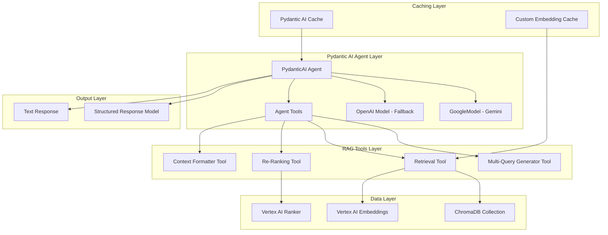

# Design Document

## Overview

Diese Design-Spezifikation beschreibt die Migration des bestehenden RAG-Systems von einem manuellen Hybrid-Ansatz zu einer vollständig integrierten Pydantic AI Lösung. Das aktuelle System verwendet eine Mischung aus manuellen API-Aufrufen, Custom-Caching und separaten Komponenten. Das neue Design nutzt Pydantic AI's native Features für strukturierte Typisierung, automatische Validierung und integrierte Tool-Funktionalität.

**Architektur-Philosophie:** Vollständige Integration in das Pydantic AI Ökosystem bei Beibehaltung aller Performance-Optimierungen und erweiterten Features des bestehenden Systems.

## Architecture

### High-Level Architecture



### Component Integration Strategy

**1. Agent-Centric Design**
- Zentraler Pydantic AI Agent als Orchestrator
- Alle RAG-Funktionen als typisierte @agent.tool Funktionen
- Native Gemini-Integration über GoogleModel

**2. Structured Data Flow**
- Pydantic-Modelle für alle Zwischenschritte
- Validierte Input/Output-Strukturen
- Typsichere Tool-Kommunikation

**3. Performance-First Approach**
- Evaluation von Pydantic AI nativen Caching-Mechanismen
- Beibehaltung kritischer Custom-Optimierungen wo nötig
- Async-first Design für maximale Parallelisierung

## Components and Interfaces

### Core Agent Configuration

```python
# Pydantic AI Agent mit GoogleModel
agent = Agent(
    name="StructuredRAGAgent",
    description="Advanced RAG system with structured outputs and multi-query retrieval",
    model=GoogleModel("gemini-2.5-flash"),  # Native Gemini integration
    dependencies=RAGDependencies,
    system_prompt=STRUCTURED_SYSTEM_PROMPT
)
```

### Dependencies Structure

```python
@dataclass
class RAGDependencies:
    """Typisierte Dependencies für den RAG Agent"""
    chroma_client: chromadb.Client
    collection_name: str
    embedding_model_name: str
    vertex_project_id: Optional[str]
    vertex_location: str
    # Caching configuration
    cache_config: CacheConfig
    # Performance settings
    performance_config: PerformanceConfig
```

### Tool Architecture

**1. Multi-Query Generator Tool**
```python
@agent.tool
async def generate_query_variations(
    ctx: RunContext[RAGDependencies], 
    original_query: str
) -> QueryVariations:
    """Generiert strukturierte Query-Variationen für komplexe Fragen"""
    # Adaptive Strategie basierend auf Fragenkomplexität
    # Strukturierte Pydantic-Ausgabe mit Validierung
```

**2. Structured Retrieval Tool**
```python
@agent.tool
async def retrieve_documents(
    ctx: RunContext[RAGDependencies],
    queries: QueryVariations
) -> RetrievalResult:
    """Paralleles Multi-Query Retrieval mit strukturierter Ausgabe"""
    # asyncio.gather für parallele Suchen
    # Unified relevance filtering
    # Strukturierte Metadaten-Rückgabe
```

**3. Re-Ranking Tool**
```python
@agent.tool
async def rerank_documents(
    ctx: RunContext[RAGDependencies],
    documents: RetrievalResult,
    query: str
) -> RankedDocuments:
    """Vertex AI Re-Ranking als separates, testbares Tool"""
    # Native Vertex AI Integration
    # Strukturierte Score-Rückgabe
```

### Model Integration Strategy

**Gemini Integration (Primary)**
- Native GoogleModel aus pydantic_ai.models.google
- Konfiguration über Pydantic AI Provider
- Automatische Retry-Logik und Error-Handling

**OpenAI Fallback (Secondary)**
- Nahtloser Fallback bei Gemini-Fehlern
- Gleiche Tool-Interface für beide Modelle
- Transparente Model-Switching-Logik

**Design-Rationale:** Native Pydantic AI Model-Integration eliminiert manuelle API-Aufrufe und bietet bessere Error-Handling und Retry-Mechanismen.

## Data Models

### Input Models

```python
class QueryVariations(BaseModel):
    """Strukturierte Query-Variationen für Multi-Query Retrieval"""
    original_query: str
    variations: List[str] = Field(..., min_items=1, max_items=3)
    complexity_score: float = Field(..., ge=0, le=1)
    strategy: QueryStrategy

class QueryStrategy(str, Enum):
    SIMPLE = "simple"      # 1 Variation
    MODERATE = "moderate"  # 2 Variationen
    COMPLEX = "complex"    # 3 Variationen
```

### Processing Models

```python
class RetrievalResult(BaseModel):
    """Strukturierte Retrieval-Ergebnisse"""
    documents: List[DocumentChunk]
    metadata: List[DocumentMetadata]
    retrieval_stats: RetrievalStats

class DocumentChunk(BaseModel):
    content: str
    chunk_id: str
    relevance_score: Optional[float]

class RankedDocuments(BaseModel):
    """Re-Ranking Ergebnisse"""
    documents: List[RankedDocument]
    ranking_stats: RankingStats

class RankedDocument(BaseModel):
    content: str
    metadata: DocumentMetadata
    rank_score: float
    original_relevance: Optional[float]
```

### Output Models

```python
class StructuredRagAnswer(BaseModel):
    """Erweiterte strukturierte Antwort"""
    summary: str = Field(..., description="Prägnante Zusammenfassung")
    key_details: List[str] = Field(..., description="Wichtigste Fakten")
    contact_info: Optional[str] = Field(None, description="Kontaktinformationen")
    sources: List[SourceReference] = Field(..., description="Strukturierte Quellenverweise")
    confidence_score: float = Field(..., ge=0, le=1, description="Konfidenzwert")
    retrieval_metadata: RetrievalMetadata = Field(..., description="Retrieval-Qualitätsmetriken")

class SourceReference(BaseModel):
    """Strukturierte Quellenreferenz"""
    url: str
    title: Optional[str]
    relevance_score: float
    chunk_count: int

class RetrievalMetadata(BaseModel):
    """Metadaten zur Retrieval-Qualität"""
    total_documents_found: int
    queries_used: int
    average_relevance: float
    reranking_applied: bool
```

## Error Handling

### Structured Error Models

```python
class RAGError(BaseModel):
    """Strukturierte Fehlerbehandlung"""
    error_type: ErrorType
    message: str
    context: Dict[str, Any]
    recovery_suggestions: List[str]

class ErrorType(str, Enum):
    RETRIEVAL_FAILED = "retrieval_failed"
    EMBEDDING_ERROR = "embedding_error"
    RERANKING_ERROR = "reranking_error"
    MODEL_ERROR = "model_error"
    VALIDATION_ERROR = "validation_error"
```

### Error Handling Strategy

**1. Graceful Degradation**
- Fallback von Gemini zu OpenAI bei Model-Fehlern
- Fallback von Vertex AI Re-Ranking zu Score-basiertem Ranking
- Fallback von Multi-Query zu Single-Query bei Embedding-Fehlern

**2. Structured Error Responses**
- Alle Fehler als validierte Pydantic-Modelle
- Kontextuelle Informationen für Debugging
- Benutzerfreundliche Fehlermeldungen

**3. Retry Logic**
- Native Pydantic AI Retry-Mechanismen
- Exponential Backoff für API-Aufrufe
- Circuit Breaker Pattern für kritische Services

**Design-Rationale:** Strukturierte Fehlerbehandlung ermöglicht bessere Observability und automatische Recovery-Strategien.

## Testing Strategy

### Unit Testing Approach

**1. Tool-Level Testing**
```python
# Jedes @agent.tool als separate, testbare Einheit
async def test_generate_query_variations():
    result = await generate_query_variations(mock_context, "test query")
    assert isinstance(result, QueryVariations)
    assert len(result.variations) >= 1
```

**2. Model Validation Testing**
```python
# Pydantic-Model Validierung
def test_structured_answer_validation():
    with pytest.raises(ValidationError):
        StructuredRagAnswer(confidence_score=1.5)  # Invalid range
```

**3. Integration Testing**
```python
# End-to-End Agent Testing
async def test_full_rag_pipeline():
    response = await agent.run("test question", deps=test_deps)
    assert isinstance(response.data, StructuredRagAnswer)
```

### Performance Testing

**1. Caching Effectiveness**
- Hit-Rate Metriken für verschiedene Cache-Strategien
- Latenz-Vergleiche zwischen Pydantic AI Cache und Custom Cache
- Memory-Usage Profiling

**2. Parallel Processing**
- Throughput-Tests für Multi-Query Retrieval
- Latenz-Optimierung für asyncio.gather Operations
- Resource-Usage bei verschiedenen Parallelisierungsgraden

**3. Model Performance**
- Response-Zeit Vergleiche Gemini vs. OpenAI
- Fallback-Latenz Messungen
- Token-Usage Optimierung

**Design-Rationale:** Umfassende Testing-Strategie stellt sicher, dass die Migration keine Performance-Regression verursacht und alle strukturierten Outputs korrekt validiert werden.

## Migration Strategy

### Phase 1: Core Agent Setup
- Pydantic AI Agent mit GoogleModel konfigurieren
- Basis-Dependencies und Konfiguration migrieren
- Einfache Tool-Struktur implementieren

### Phase 2: Tool Migration
- Bestehende Funktionen als @agent.tool implementieren
- Strukturierte Input/Output-Modelle einführen
- Parallel Testing mit bestehendem System

### Phase 3: Caching Integration
- Evaluation von Pydantic AI nativen Caching-Mechanismen
- Migration oder Integration bestehender Custom-Caches
- Performance-Benchmarking

### Phase 4: Advanced Features
- Multi-Query Retrieval mit strukturierten Outputs
- Erweiterte Error-Handling und Fallback-Strategien
- Vollständige Rückwärtskompatibilität

### Phase 5: Optimization & Cleanup
- Performance-Tuning basierend auf Benchmarks
- Entfernung deprecated Code-Pfade
- Dokumentation und Final Testing

**Design-Rationale:** Phasenweise Migration minimiert Risiken und ermöglicht kontinuierliche Validierung der Funktionalität bei jedem Schritt.