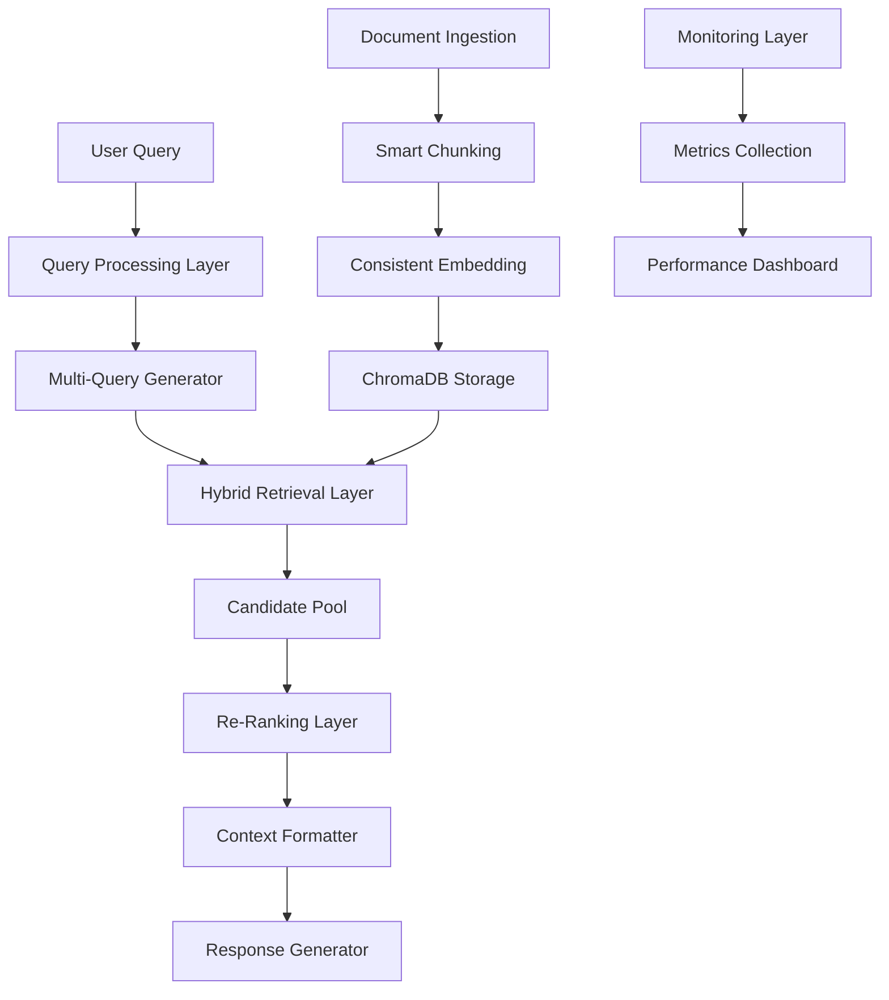

# Design Document

## Overview

Dieses Design implementiert eine robuste, themen-agnostische RAG-Pipeline basierend auf bewährten Best Practices. Die Architektur trennt klar zwischen High-Recall Candidate Generation und präzisem Re-Ranking, um Recall-Verluste zu minimieren.

## Architecture

### Gesamtarchitektur



### Pipeline-Phasen

## Components and Interfaces

### 1. Enhanced Document Processing Pipeline

```python
class SmartChunkingConfig(BaseModel):
    """Configuration for intelligent chunking strategies."""
    min_tokens: int = Field(default=30, ge=10, le=100)
    max_tokens: int = Field(default=256, ge=100, le=512)
    heading_boundary_split: bool = Field(default=True)
    preserve_code_blocks: bool = Field(default=True)
    preserve_lists: bool = Field(default=True)
    semantic_chunking: bool = Field(default=True)

class DocumentChunkEnhanced(BaseModel):
    """Enhanced document chunk with rich metadata."""
    content: str = Field(..., description="Chunk content")
    metadata: DocumentMetadataEnhanced = Field(..., description="Enhanced metadata")
    embedding: Optional[List[float]] = Field(None, description="Normalized embedding vector")
    chunk_id: str = Field(..., description="Unique chunk identifier")
    heading_path: str = Field(..., description="Hierarchical heading path")
    content_type: str = Field(..., description="Type of content (text, code, list, table)")
    language: Optional[str] = Field(None, description="Detected language")
    token_count: int = Field(..., ge=1, description="Actual token count")

class DocumentMetadataEnhanced(BaseModel):
    """Enhanced metadata with crawling context."""
    url: str = Field(..., description="Source URL")
    title: Optional[str] = Field(None, description="Document title")
    heading_path: str = Field(..., description="Full heading hierarchy")
    crawl_timestamp: str = Field(..., description="ISO timestamp of crawling")
    language: str = Field(..., description="Detected document language")
    content_hash: str = Field(..., description="Content hash for deduplication")
    chunk_index: int = Field(..., ge=0, description="Index within document")
    total_chunks: int = Field(..., ge=1, description="Total chunks in document")
```

### 2. Consistent Embedding System

```python
class EmbeddingConfig(BaseModel):
    """Configuration for consistent embedding generation."""
    model_name: str = Field(default="gemini-embedding-001")
    output_dimensionality: int = Field(default=768)
    normalize_vectors: bool = Field(default=True)
    task_type_document: str = Field(default="RETRIEVAL_DOCUMENT")
    task_type_query: str = Field(default="RETRIEVAL_QUERY")

class EmbeddingMetadata(BaseModel):
    """Metadata stored with ChromaDB collection."""
    embedding_model: str = Field(..., description="Model used for embeddings")
    dimension: int = Field(..., description="Vector dimension")
    normalization: bool = Field(..., description="Whether vectors are normalized")
    created_at: str = Field(..., description="Creation timestamp")
    version: str = Field(..., description="Embedding version")

@agent.tool
async def generate_consistent_embedding(
    ctx: RunContext[RAGDeps],
    text: str,
    task_type: str = "RETRIEVAL_QUERY"
) -> List[float]:
    """Generate consistent, normalized embeddings."""
    # Implementation with caching and normalization
    pass
```

### 3. High-Recall Hybrid Retrieval Layer

```python
class HybridRetrievalConfig(BaseModel):
    """Configuration for hybrid retrieval strategy."""
    enable_bm25: bool = Field(default=True)
    enable_semantic: bool = Field(default=True)
    bm25_weight: float = Field(default=0.3, ge=0.0, le=1.0)
    semantic_weight: float = Field(default=0.7, ge=0.0, le=1.0)
    candidate_multiplier: int = Field(default=10, ge=5, le=20)
    min_candidates: int = Field(default=200, ge=50, le=500)
    enable_multi_query: bool = Field(default=True)
    max_query_variations: int = Field(default=5, ge=1, le=10)

class CandidateDocument(BaseModel):
    """Document candidate with retrieval scores."""
    document: DocumentChunkEnhanced = Field(..., description="Document chunk")
    bm25_score: float = Field(..., description="BM25 relevance score")
    semantic_score: float = Field(..., description="Semantic similarity score")
    hybrid_score: float = Field(..., description="Combined hybrid score")
    retrieval_method: str = Field(..., description="Method that retrieved this candidate")
    query_variation: Optional[str] = Field(None, description="Query variation that found this")

@agent.tool
async def hybrid_retrieval_layer(
    ctx: RunContext[RAGDeps],
    query_variations: QueryVariations,
    config: HybridRetrievalConfig
) -> List[CandidateDocument]:
    """High-recall candidate generation with hybrid search."""
    # Implementation combining BM25 and semantic search
    pass
```

### 4. Domain-Agnostic Re-Ranking Layer

```python
class ReRankingConfig(BaseModel):
    """Configuration for re-ranking strategies."""
    primary_method: str = Field(default="vertex_ai", choices=["vertex_ai", "cross_encoder", "cosine"])
    fallback_methods: List[str] = Field(default=["cross_encoder", "cosine"])
    vertex_model: Optional[str] = Field(None, description="Vertex AI ranking model")
    cross_encoder_model: str = Field(default="cross-encoder/ms-marco-MiniLM-L-6-v2")
    max_candidates: int = Field(default=100, ge=10, le=500)
    final_top_k: int = Field(default=15, ge=5, le=50)

class ReRankedDocument(BaseModel):
    """Document with re-ranking scores."""
    document: DocumentChunkEnhanced = Field(..., description="Document chunk")
    original_score: float = Field(..., description="Original retrieval score")
    rerank_score: float = Field(..., description="Re-ranking score")
    rerank_method: str = Field(..., description="Method used for re-ranking")
    final_rank: int = Field(..., ge=1, description="Final rank position")
    confidence: float = Field(..., ge=0.0, le=1.0, description="Ranking confidence")

@agent.tool
async def domain_agnostic_reranking(
    ctx: RunContext[RAGDeps],
    candidates: List[CandidateDocument],
    query: str,
    config: ReRankingConfig
) -> List[ReRankedDocument]:
    """Domain-agnostic re-ranking with fallback strategies."""
    # Implementation with Vertex AI, Cross-Encoder, and Cosine fallbacks
    pass
```

### 5. Intelligent Stop-Word Handling

```python
class StopWordConfig(BaseModel):
    """Configuration for intelligent stop-word handling."""
    enable_language_detection: bool = Field(default=True)
    enable_domain_specific: bool = Field(default=True)
    fallback_language: str = Field(default="de")
    confidence_threshold: float = Field(default=0.8, ge=0.5, le=1.0)

class LanguageProcessor(BaseModel):
    """Language-aware text processing."""
    detected_language: str = Field(..., description="Detected language code")
    confidence: float = Field(..., ge=0.0, le=1.0, description="Detection confidence")
    stop_words: Set[str] = Field(..., description="Language-specific stop words")
    domain_terms: Set[str] = Field(default_factory=set, description="Domain-specific terms to preserve")

@agent.tool
async def intelligent_text_processing(
    ctx: RunContext[RAGDeps],
    text: str,
    config: StopWordConfig
) -> LanguageProcessor:
    """Intelligent language detection and stop-word handling."""
    # Implementation with langdetect and domain-specific term preservation
    pass
```

## Data Models

### Enhanced Query Processing

```python
class QueryIntent(str, Enum):
    """Detected query intent types."""
    FACTUAL = "factual"
    DEFINITIONAL = "definitional"
    PROCEDURAL = "procedural"
    COMPARATIVE = "comparative"
    ANALYTICAL = "analytical"
    EXPLORATORY = "exploratory"

class EnhancedQueryVariations(BaseModel):
    """Enhanced query variations with intent analysis."""
    original_query: str = Field(..., description="Original user query")
    detected_intent: QueryIntent = Field(..., description="Detected query intent")
    language: str = Field(..., description="Detected query language")
    variations: List[str] = Field(..., description="Generated query variations")
    synonyms: List[str] = Field(default_factory=list, description="Domain-specific synonyms")
    question_to_statement: str = Field(..., description="Statement form of the question")
    complexity_score: float = Field(..., ge=0.0, le=1.0, description="Query complexity")
    domain_hints: List[str] = Field(default_factory=list, description="Detected domain indicators")
```

### Pipeline Monitoring

```python
class PipelineMetrics(BaseModel):
    """Comprehensive pipeline performance metrics."""
    answer_empty_rate: float = Field(..., ge=0.0, le=1.0, description="Rate of empty answers")
    recall_at_k: Dict[int, float] = Field(..., description="Recall@k for different k values")
    chunk_hit_histogram: Dict[str, int] = Field(..., description="Hits per pipeline step")
    average_response_time: float = Field(..., ge=0.0, description="Average response time in seconds")
    cache_hit_rate: float = Field(..., ge=0.0, le=1.0, description="Overall cache hit rate")
    error_rate_by_component: Dict[str, float] = Field(..., description="Error rates per component")
    language_distribution: Dict[str, int] = Field(..., description="Query language distribution")
    intent_distribution: Dict[str, int] = Field(..., description="Query intent distribution")

class QualityMetrics(BaseModel):
    """Quality assessment metrics."""
    relevance_scores: List[float] = Field(..., description="Relevance scores for retrieved chunks")
    diversity_score: float = Field(..., ge=0.0, le=1.0, description="Source diversity score")
    coverage_score: float = Field(..., ge=0.0, le=1.0, description="Topic coverage score")
    coherence_score: float = Field(..., ge=0.0, le=1.0, description="Response coherence score")
    factual_accuracy: Optional[float] = Field(None, description="Factual accuracy if available")
```

## Error Handling

### Fail-Open Strategy Implementation

```python
class FailOpenConfig(BaseModel):
    """Configuration for fail-open behavior."""
    min_chunks_threshold: int = Field(default=3, ge=1, le=10)
    fallback_to_cosine: bool = Field(default=True)
    transparent_communication: bool = Field(default=True)
    provide_alternatives: bool = Field(default=True)
    max_fallback_chunks: int = Field(default=20, ge=5, le=50)

@agent.tool
async def fail_open_response_generator(
    ctx: RunContext[RAGDeps],
    chunks: List[ReRankedDocument],
    query: str,
    config: FailOpenConfig
) -> str:
    """Generate responses with fail-open strategy."""
    if len(chunks) < config.min_chunks_threshold:
        # Implement fallback chunk retrieval
        additional_chunks = await retrieve_fallback_chunks(ctx, query, config)
        chunks.extend(additional_chunks)
    
    # Always generate a response, but communicate limitations transparently
    response = await generate_response_with_transparency(ctx, chunks, query)
    return response
```

## Testing Strategy

### Component-Level Testing

```python
class TestScenario(BaseModel):
    """Test scenario for pipeline components."""
    name: str = Field(..., description="Test scenario name")
    query: str = Field(..., description="Test query")
    expected_chunks: List[str] = Field(..., description="Expected chunk IDs")
    domain: str = Field(..., description="Domain/topic area")
    language: str = Field(..., description="Query language")
    complexity: QueryStrategy = Field(..., description="Query complexity level")

class PipelineTestSuite(BaseModel):
    """Comprehensive test suite for pipeline validation."""
    scenarios: List[TestScenario] = Field(..., description="Test scenarios")
    gold_standard_chunks: Dict[str, str] = Field(..., description="Gold standard chunk content")
    evaluation_metrics: List[str] = Field(..., description="Metrics to evaluate")
    
@agent.tool
async def run_pipeline_evaluation(
    ctx: RunContext[RAGDeps],
    test_suite: PipelineTestSuite
) -> PipelineMetrics:
    """Run comprehensive pipeline evaluation."""
    # Implementation of automated testing and evaluation
    pass
```

### Integration Testing

```python
class EndToEndTestConfig(BaseModel):
    """Configuration for end-to-end testing."""
    test_domains: List[str] = Field(..., description="Domains to test")
    test_languages: List[str] = Field(..., description="Languages to test")
    sample_size_per_domain: int = Field(default=50, ge=10, le=200)
    evaluation_criteria: List[str] = Field(..., description="Evaluation criteria")

@agent.tool
async def end_to_end_pipeline_test(
    ctx: RunContext[RAGDeps],
    config: EndToEndTestConfig
) -> Dict[str, PipelineMetrics]:
    """Run end-to-end pipeline testing across domains and languages."""
    # Implementation of comprehensive integration testing
    pass
```

## Performance Considerations

### Optimization Strategies

1. **Embedding Caching**: Aggressive caching with L2 normalization
2. **Parallel Processing**: Concurrent query variation processing
3. **Batch Operations**: Batch embedding generation and re-ranking
4. **Memory Management**: Efficient chunk storage and retrieval
5. **Connection Pooling**: Optimized database connections

### Scalability Design

1. **Horizontal Scaling**: Stateless component design
2. **Load Balancing**: Distribute processing across instances
3. **Caching Layers**: Multi-level caching strategy
4. **Resource Management**: Dynamic resource allocation
5. **Monitoring**: Real-time performance monitoring

## Security Considerations

1. **Input Validation**: Comprehensive query and document validation
2. **Rate Limiting**: Prevent abuse of embedding and re-ranking APIs
3. **Data Privacy**: Secure handling of crawled content
4. **Access Control**: Role-based access to different pipeline components
5. **Audit Logging**: Comprehensive logging for security analysis