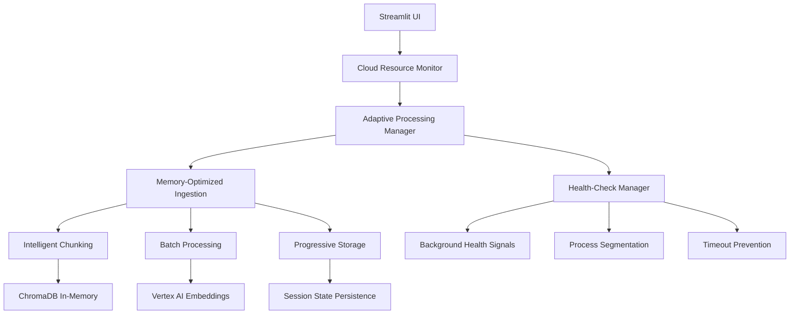

# Design Document: Streamlit Cloud Optimization

## Overview

CraCha funktioniert lokal perfekt, aber auf Streamlit Community Cloud treten Memory- und Timeout-Probleme auf. Diese Design-Lösung implementiert eine umfassende Cloud-Optimierung, die Memory-Management, Health-Check-Kompatibilität und intelligente Dataset-Reduktion kombiniert, um eine stabile Ausführung auf Streamlit Community Cloud zu gewährleisten.

Das Design basiert auf der bestehenden Architektur mit Modal.com Crawler, ChromaDB und Vertex AI Embeddings, erweitert diese jedoch um Cloud-spezifische Optimierungen und Fallback-Mechanismen.

## Architecture

### Current Architecture Analysis
- **Frontend**: Streamlit App (`streamlit_app.py`) mit Tab-basierter UI
- **Crawling**: Modal.com Remote Crawler (`crawler_client.py`)
- **Processing**: Synchrone Ingestion Pipeline (`insert_docs_streamlit.py`)
- **Storage**: In-Memory ChromaDB mit optionalen Vertex AI Embeddings
- **RAG**: Pydantic AI Agent mit strukturierten Responses (`rag_agent.py`)

### Cloud-Optimized Architecture



## Components and Interfaces

### 1. Cloud Resource Monitor

**Purpose**: Überwacht Memory-Verbrauch und System-Ressourcen in Echtzeit

```python
class CloudResourceMonitor:
    def __init__(self, memory_limit_mb: int = 1000):
        self.memory_limit = memory_limit_mb
        self.current_usage = 0
        
    def check_memory_usage(self) -> MemoryStatus:
        """Prüft aktuellen Memory-Verbrauch"""
        
    def estimate_processing_memory(self, chunk_count: int, avg_chunk_size: int) -> int:
        """Schätzt Memory-Bedarf für Verarbeitung"""
        
    def suggest_optimization(self) -> OptimizationStrategy:
        """Schlägt Memory-Optimierungen vor"""
```

**Integration Points**:
- Wird in `insert_docs_streamlit.py` vor jeder Verarbeitungsphase aufgerufen
- Kommuniziert mit `AdaptiveProcessingManager` für dynamische Anpassungen

### 2. Adaptive Processing Manager

**Purpose**: Koordiniert die Verarbeitung basierend auf verfügbaren Ressourcen

```python
class AdaptiveProcessingManager:
    def __init__(self, resource_monitor: CloudResourceMonitor):
        self.resource_monitor = resource_monitor
        self.processing_strategy = ProcessingStrategy.CONSERVATIVE
        
    def determine_processing_strategy(self, dataset_size: int) -> ProcessingStrategy:
        """Bestimmt optimale Verarbeitungsstrategie"""
        
    def adjust_batch_sizes(self, current_memory: int) -> BatchConfig:
        """Passt Batch-Größen dynamisch an"""
        
    def should_reduce_dataset(self, chunk_count: int) -> bool:
        """Entscheidet über Dataset-Reduktion"""
```

**Integration Points**:
- Zentrale Koordination in `run_ingestion_sync()`
- Steuert `MemoryOptimizedIngestion` und `HealthCheckManager`

### 3. Memory-Optimized Ingestion Pipeline

**Purpose**: Erweitert bestehende Ingestion um Memory-bewusste Verarbeitung

```python
class MemoryOptimizedIngestion:
    def __init__(self, base_ingestion: IngestionPipeline):
        self.base_ingestion = base_ingestion
        self.memory_monitor = CloudResourceMonitor()
        
    async def process_with_memory_management(
        self, 
        crawl_results: List[Dict],
        processing_config: ProcessingConfig
    ) -> IngestionResult:
        """Verarbeitet Crawl-Ergebnisse mit Memory-Management"""
        
    def intelligent_chunk_reduction(
        self, 
        chunks: List[str], 
        target_count: int
    ) -> List[str]:
        """Reduziert Chunks intelligent basierend auf Relevanz"""
        
    def progressive_embedding_generation(
        self, 
        chunks: List[str]
    ) -> List[List[float]]:
        """Generiert Embeddings in Memory-schonenden Batches"""
```

**Integration Points**:
- Ersetzt direkte Aufrufe in `run_ingestion_sync()`
- Nutzt bestehende `smart_chunk_markdown()` und Vertex AI Integration

### 4. Health-Check Manager

**Purpose**: Verhindert Streamlit Cloud Timeouts durch aktive Health-Signale

```python
class HealthCheckManager:
    def __init__(self, max_processing_time: int = 18 * 60):  # 18 Minuten
        self.max_processing_time = max_processing_time
        self.last_health_signal = time.time()
        
    async def start_health_monitoring(self):
        """Startet Background Health-Check Task"""
        
    def send_health_signal(self, progress_message: str):
        """Sendet Health-Signal an Streamlit"""
        
    def should_segment_process(self, estimated_time: float) -> bool:
        """Entscheidet über Prozess-Segmentierung"""
        
    async def segment_long_process(
        self, 
        process_func: Callable,
        segments: int
    ) -> Any:
        """Teilt lange Prozesse in Segmente auf"""
```

**Integration Points**:
- Läuft parallel zu Ingestion-Prozess
- Integriert mit Streamlit Progress-Updates

### 5. Intelligent Dataset Reduction

**Purpose**: Reduziert große Datasets automatisch ohne Qualitätsverlust

```python
class IntelligentDatasetReducer:
    def __init__(self, max_chunks: int = 5000):
        self.max_chunks = max_chunks
        
    def analyze_dataset_complexity(self, chunks: List[str]) -> DatasetAnalysis:
        """Analysiert Dataset-Komplexität und -Qualität"""
        
    def score_chunk_importance(self, chunk: str, context: str) -> float:
        """Bewertet Wichtigkeit eines Chunks"""
        
    def reduce_dataset_intelligently(
        self, 
        chunks: List[str], 
        target_size: int
    ) -> List[str]:
        """Reduziert Dataset unter Beibehaltung wichtiger Inhalte"""
        
    def preserve_document_structure(self, chunks: List[str]) -> List[str]:
        """Erhält Dokumentstruktur bei Reduktion"""
```

**Integration Points**:
- Wird in `MemoryOptimizedIngestion` vor Embedding-Generierung aufgerufen
- Nutzt bestehende Chunk-Metadaten für Scoring

## Data Models

### Cloud-Specific Configuration

```python
class CloudOptimizationConfig(BaseModel):
    memory_limit_mb: int = 1000
    max_processing_time_minutes: int = 18
    health_check_interval_seconds: int = 30
    auto_reduce_enabled: bool = True
    max_chunks_cloud: int = 5000
    conservative_batch_size: int = 50
    embedding_batch_size: int = 20
    
class MemoryStatus(BaseModel):
    current_usage_mb: int
    available_mb: int
    usage_percentage: float
    status: Literal["safe", "warning", "critical"]
    
class ProcessingStrategy(str, Enum):
    AGGRESSIVE = "aggressive"      # Lokale Entwicklung
    BALANCED = "balanced"          # Normale Cloud-Nutzung
    CONSERVATIVE = "conservative"  # Große Datasets auf Cloud
    
class OptimizationResult(BaseModel):
    original_chunk_count: int
    optimized_chunk_count: int
    memory_saved_mb: float
    processing_time_saved_seconds: float
    quality_retention_score: float
```

### Enhanced Progress Tracking

```python
class CloudProgressTracker(IngestionProgress):
    def __init__(self, health_manager: HealthCheckManager):
        super().__init__()
        self.health_manager = health_manager
        self.segment_progress = {}
        
    def update_with_health_check(self, step: int, message: str):
        """Update mit automatischem Health-Check"""
        
    def track_memory_usage(self, operation: str, memory_mb: float):
        """Verfolgt Memory-Verbrauch pro Operation"""
        
    def handle_timeout_warning(self, remaining_time: float):
        """Behandelt Timeout-Warnungen"""
```

## Error Handling

### Cloud-Specific Error Types

```python
class CloudErrorType(str, Enum):
    MEMORY_LIMIT_EXCEEDED = "memory_limit_exceeded"
    HEALTH_CHECK_TIMEOUT = "health_check_timeout"
    RESOURCE_EXHAUSTION = "resource_exhaustion"
    CLOUD_SERVICE_UNAVAILABLE = "cloud_service_unavailable"
    
class CloudErrorHandler:
    def __init__(self):
        self.fallback_strategies = {
            CloudErrorType.MEMORY_LIMIT_EXCEEDED: self._handle_memory_limit,
            CloudErrorType.HEALTH_CHECK_TIMEOUT: self._handle_timeout,
            CloudErrorType.RESOURCE_EXHAUSTION: self._handle_resource_exhaustion
        }
        
    async def handle_cloud_error(
        self, 
        error: CloudErrorType, 
        context: Dict[str, Any]
    ) -> RecoveryResult:
        """Behandelt Cloud-spezifische Fehler"""
```

### Fallback Mechanisms

1. **Memory Limit Exceeded**:
   - Automatische Chunk-Reduktion um 50%
   - Wechsel zu kleineren Batch-Größen
   - Fallback auf ChromaDB Standard-Embeddings

2. **Health Check Timeout**:
   - Prozess-Segmentierung aktivieren
   - Session State Zwischenspeicherung
   - Fortsetzung in neuer Session

3. **Vertex AI Unavailable**:
   - Automatischer Fallback auf ChromaDB Embeddings
   - Warnung an User über reduzierte Qualität
   - Fortsetzung der Verarbeitung

## Testing Strategy

### Cloud Environment Simulation

```python
class CloudEnvironmentSimulator:
    def __init__(self):
        self.memory_limit = 1000  # MB
        self.processing_timeout = 19 * 60  # 19 Minuten
        
    def simulate_memory_pressure(self, target_usage: float):
        """Simuliert Memory-Druck"""
        
    def simulate_timeout_scenario(self, processing_time: float):
        """Simuliert Timeout-Szenarien"""
        
    def test_optimization_strategies(self):
        """Testet verschiedene Optimierungsstrategien"""
```

### Performance Benchmarks

1. **Memory Usage Tests**:
   - Verschiedene Dataset-Größen (1K, 3K, 5K+ Chunks)
   - Memory-Verbrauch pro Verarbeitungsschritt
   - Optimierung-Effektivität

2. **Timeout Prevention Tests**:
   - Lange Crawling-Prozesse (100+ URLs)
   - Health-Check Funktionalität
   - Prozess-Segmentierung

3. **Quality Retention Tests**:
   - RAG-Qualität vor/nach Optimierung
   - Chunk-Reduktion Auswirkungen
   - Embedding-Qualität Vergleich

### Integration Tests

```python
class CloudIntegrationTests:
    async def test_large_dataset_processing(self):
        """Testet Verarbeitung großer Datasets"""
        
    async def test_memory_optimization_pipeline(self):
        """Testet Memory-Optimierung Pipeline"""
        
    async def test_health_check_integration(self):
        """Testet Health-Check Integration"""
        
    async def test_fallback_mechanisms(self):
        """Testet Fallback-Mechanismen"""
```

## Design Decisions and Rationales

### 1. In-Memory ChromaDB Retention
**Decision**: Beibehaltung der In-Memory ChromaDB statt Persistent Storage
**Rationale**: 
- Streamlit Community Cloud hat begrenzte Disk-Persistenz
- In-Memory ist schneller für RAG-Queries
- Session-basierte Nutzung passt zu Streamlit-Paradigma

### 2. Progressive Processing Architecture
**Decision**: Segmentierung langer Prozesse statt kompletter Neuentwicklung
**Rationale**:
- Minimale Änderungen an bestehender Architektur
- Kompatibilität mit Streamlit Health-Checks
- Benutzerfreundliche Progress-Updates

### 3. Intelligent Dataset Reduction
**Decision**: Content-basierte Chunk-Reduktion statt einfache Limits
**Rationale**:
- Erhält Informationsqualität
- Nutzt bestehende Chunk-Metadaten
- Skaliert automatisch mit Dataset-Größe

### 4. Dual Embedding Strategy
**Decision**: Vertex AI mit ChromaDB Fallback
**Rationale**:
- Beste Qualität wenn verfügbar
- Robuste Fallback-Option
- Transparente Degradation für User

### 5. Resource-Aware Batch Processing
**Decision**: Dynamische Batch-Größen basierend auf Memory
**Rationale**:
- Optimale Ressourcennutzung
- Verhindert Memory-Spitzen
- Anpassung an verschiedene Dataset-Größen

## Implementation Priority

### Phase 1: Core Cloud Compatibility (High Priority)
- `CloudResourceMonitor` Implementation
- Basic Memory-Management in `insert_docs_streamlit.py`
- Health-Check Integration in Streamlit UI

### Phase 2: Advanced Optimizations (Medium Priority)
- `IntelligentDatasetReducer` Implementation
- Progressive Processing für große Datasets
- Enhanced Error Handling

### Phase 3: Performance Tuning (Low Priority)
- Advanced Caching Strategies
- Predictive Resource Management
- User Experience Optimizations

Diese Design-Lösung gewährleistet, dass CraCha stabil auf Streamlit Community Cloud läuft, während die bestehende Funktionalität und Benutzerfreundlichkeit erhalten bleibt.